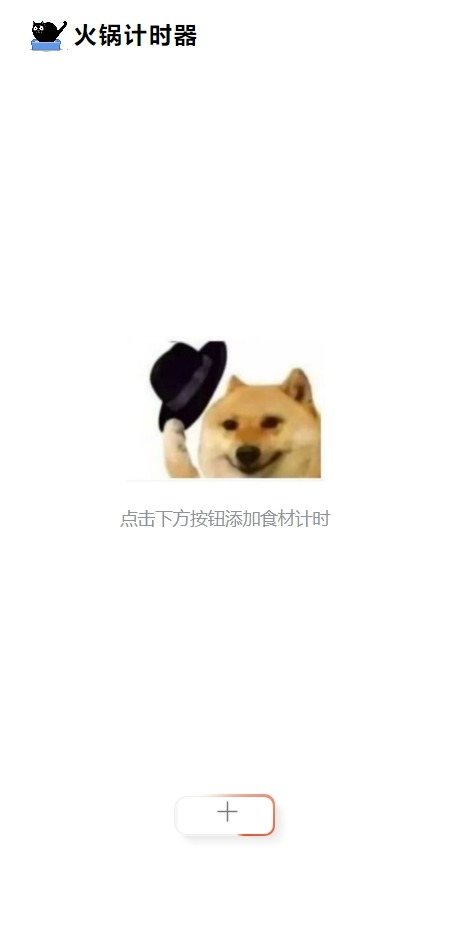
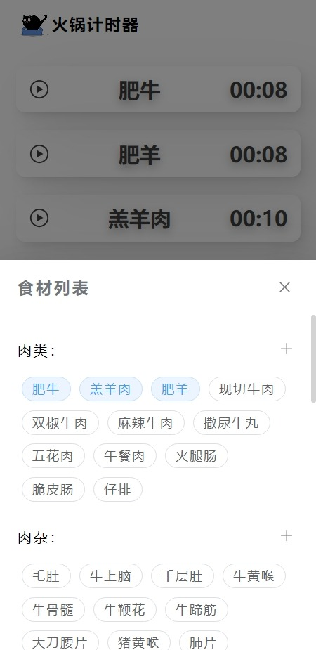
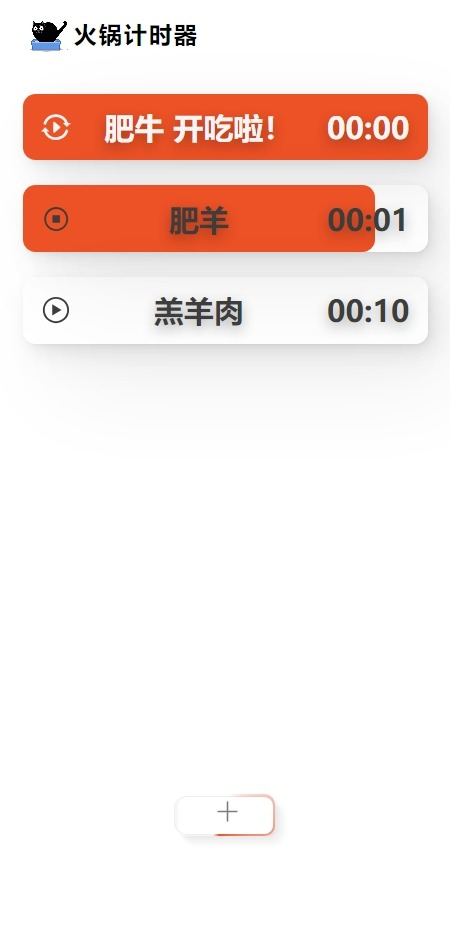

# 火锅计时器

辅助爱锅人士把握不同食材的下锅时间

### 简介

vue3 + typescript + vite + element-plus

### 功能

1. 添加食材进行计时
2. 添加或修改食材数据
3. 重置食材数据
4. 导入导出食材数据
5. 跟随系统开启夜间模式

### 截图

<p float="left">
    
    
    
</p>

### 安装与使用

-   **install：**

```bash
pnpm install
```

-   **run：**

```bash
pnpm dev
```

-   **docker deploy：**

```bash
pnpm build

docker compose up -d
```

## 许可证

本项目使用[MIT 许可证](LICENSE)。

## 联系方式


